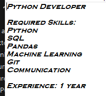
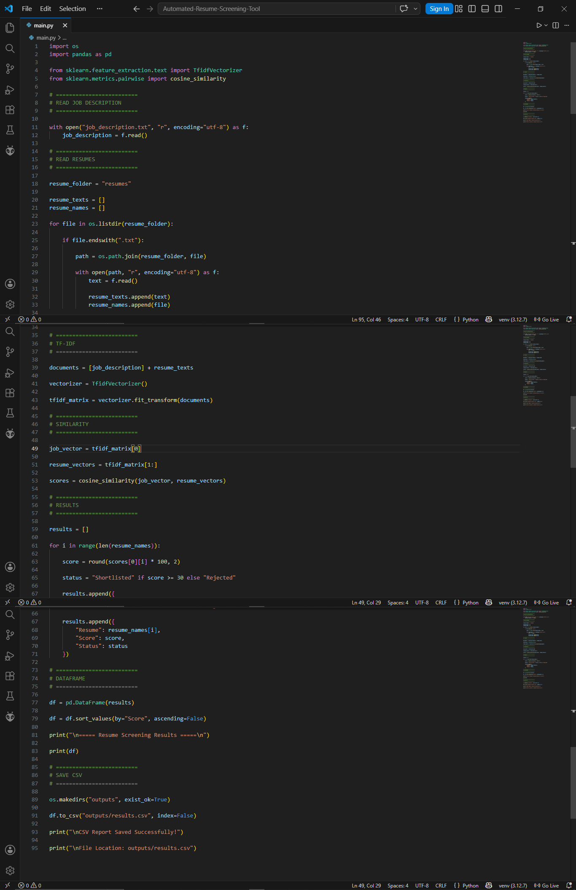
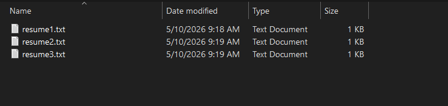
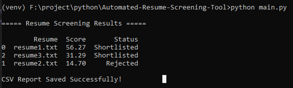
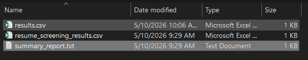

# Automated Resume Screening Tool

## Project Overview

The Automated Resume Screening Tool is an AI/NLP-based Python project that helps recruiters and HR teams automatically analyze resumes and compare them with job descriptions. The system extracts resume text, identifies important skills, calculates similarity scores, ranks candidates, and generates shortlist reports similar to real ATS (Applicant Tracking System) platforms.

This project demonstrates practical implementation of:
- NLP (Natural Language Processing)
- Resume Parsing
- ATS-style Candidate Screening
- TF-IDF Vectorization
- Cosine Similarity
- Python Automation
- HR Tech Systems

---

# Problem Statement

Recruiters often receive hundreds of resumes for a single job opening. Manually reviewing every resume takes significant time and effort.

This project solves that problem by:
- Automatically reading resumes
- Extracting candidate skills
- Comparing resumes with job requirements
- Calculating matching scores
- Ranking candidates automatically
- Generating shortlist reports

---

# Industry Relevance

Modern ATS (Applicant Tracking Systems) use automation and AI to:
- Reduce hiring time
- Improve candidate filtering
- Standardize resume screening
- Match job requirements with candidate skills

This project simulates a real-world ATS screening workflow used in:
- HR Tech Companies
- Recruitment Agencies
- Corporate Hiring Systems
- Campus Recruitment
- Talent Management Platforms

---

# Features

✅ Resume Text Extraction  
✅ PDF Resume Support  
✅ DOCX Resume Support  
✅ TXT Resume Support  
✅ Job Description Matching  
✅ Skill Extraction  
✅ Experience Detection  
✅ TF-IDF Vectorization  
✅ Cosine Similarity Scoring  
✅ Candidate Ranking  
✅ ATS-style Resume Screening  
✅ CSV Report Generation  
✅ Summary Report Generation  
✅ Beginner Friendly Code  
✅ GitHub Ready Structure  

---

# Technologies Used

| Technology | Purpose |
|---|---|
| Python | Core Programming |
| Pandas | Data Handling |
| NumPy | Numerical Operations |
| Scikit-learn | TF-IDF & Similarity |
| pdfplumber | PDF Text Extraction |
| python-docx | DOCX Text Extraction |
| Regex | Text Cleaning |
| NLP | Skill Matching |

---

# Project Architecture

```text
Resume Files
      ↓
Text Extraction
      ↓
Text Cleaning
      ↓
Skill Extraction
      ↓
TF-IDF Vectorization
      ↓
Cosine Similarity
      ↓
Score Calculation
      ↓
Candidate Ranking
      ↓
Shortlist / Reject Decision
      ↓
CSV & Report Generation
```

---

# Project Folder Structure

```text
Automated-Resume-Screening-Tool/
│
├── resumes/
│   ├── resume1.txt
│   ├── resume2.txt
│   ├── resume3.txt
│
├── outputs/
│   ├── resume_screening_results.csv
│   └── summary_report.txt
│
├── images/
│
├── main.py
├── job_description.txt
├── requirements.txt
├── README.md
└── .gitignore
```

---

# Installation Guide

## Step 1 — Clone Repository

```bash
git clone YOUR_REPOSITORY_LINK
```

---

## Step 2 — Open Project Folder

```bash
cd Automated-Resume-Screening-Tool
```

---

## Step 3 — Install Required Libraries

```bash
pip install -r requirements.txt
```

OR

```bash
py -m pip install -r requirements.txt
```

---

# Required Libraries

```txt
pandas
numpy
scikit-learn
pdfplumber
python-docx
nltk
```

---

# How to Run Project

```bash
python main.py
```

OR

```bash
py main.py
```

---

# Expected Output

```text
===================================================
      AUTOMATED RESUME SCREENING RESULTS
===================================================

Resume File     Final Score     Status
resume1.txt        85.44      Strong Shortlist
resume3.txt        67.22      Shortlisted
resume2.txt        18.11      Rejected
```

---

# Generated Output Files

After execution:

```text
outputs/resume_screening_results.csv
outputs/summary_report.txt
```

---

# Project Images

## Folder Structure


---

## Job Description



---

## Python Code



---

## Resume Files



---

## Output



---

## Result Summary



---

# Resume Screening Process

The system performs the following steps:

1. Reads resumes from the resumes folder
2. Extracts text from TXT/PDF/DOCX files
3. Cleans resume text
4. Extracts skills
5. Detects experience
6. Reads job description
7. Converts text into TF-IDF vectors
8. Calculates cosine similarity
9. Generates matching score
10. Ranks candidates
11. Creates shortlist report

---

# Sample Skills Detected

- Python
- SQL
- Pandas
- NumPy
- Machine Learning
- Power BI
- Excel
- Communication
- Git

---

# ATS-style Scoring Logic

The final score is calculated using:
- Resume similarity score
- Skill matching score
- Experience bonus

The system classifies candidates into:
- Strong Shortlist
- Shortlisted
- Rejected

---

# Learning Outcomes

Through this project, I learned:
- Resume Parsing
- NLP Basics
- TF-IDF Vectorization
- Cosine Similarity
- ATS Workflow
- Python Automation
- Report Generation
- GitHub Project Management

---

# Future Improvements

Possible future upgrades:
- Streamlit Dashboard
- AI Skill Prediction
- Semantic Search
- Deep Learning Models
- Recruiter Dashboard
- Resume Upload UI
- LinkedIn Resume Parsing
- Cloud Deployment
- FastAPI Integration

---

# Real-World Applications

This project can be used in:
- Recruitment Automation
- HR Analytics
- Campus Hiring
- Talent Management
- Resume Filtering
- Candidate Ranking Systems

---

# Interview Questions & Answers

## 1. Explain your project.

This project is an Automated Resume Screening Tool developed using Python and NLP techniques. The system reads resumes, extracts important information, compares resumes with a job description using TF-IDF and cosine similarity, calculates scores, and ranks candidates automatically similar to real ATS systems.

---

## 2. What problem does this project solve?

It reduces manual effort in resume screening and helps recruiters shortlist suitable candidates faster.

---

## 3. Why did you use TF-IDF?

TF-IDF converts text into numerical vectors and highlights important keywords for comparison.

---

## 4. What is cosine similarity?

Cosine similarity measures how similar two text documents are based on vector representation.

---

## 5. Which libraries were used?

Pandas, NumPy, Scikit-learn, pdfplumber, python-docx, and Regex.

---

## 6. What types of resumes are supported?

TXT, PDF, and DOCX formats.

---

## 7. What outputs are generated?

CSV ranking reports and text summary reports.

---

## 8. What improvements can be added?

Advanced NLP models, dashboards, APIs, and semantic search systems.

---

## 9. How does ATS work?

ATS systems compare resumes with job descriptions using keywords, skills, experience, and ranking algorithms.

---

## 10. What did you learn from this project?

Python automation, NLP basics, ATS workflow, resume parsing, and GitHub project management.

---

# GitHub Repository

## Repository Name

```text
Automated-Resume-Screening-Tool
```

---

# GitHub Description

```text
AI-powered Automated Resume Screening Tool using Python, NLP, TF-IDF, and Cosine Similarity for ATS-style candidate ranking and resume analysis.
```

---

# GitHub Topics

```text
python
machine-learning
nlp
resume-screening
ats
tfidf
cosine-similarity
data-science
automation
hr-tech
```

---

# Author

Atharv Vishnudas Bunde  
Mechatronics Engineering Student

---

# License

This project is developed for educational and portfolio purposes.
